#**TP 5 : Traitement de flux avec Kafka Streams
Nettoyage de texte, analyse météo et comptage de clics**

##**Exercice 1 : Nettoyage et validation de messages texte**
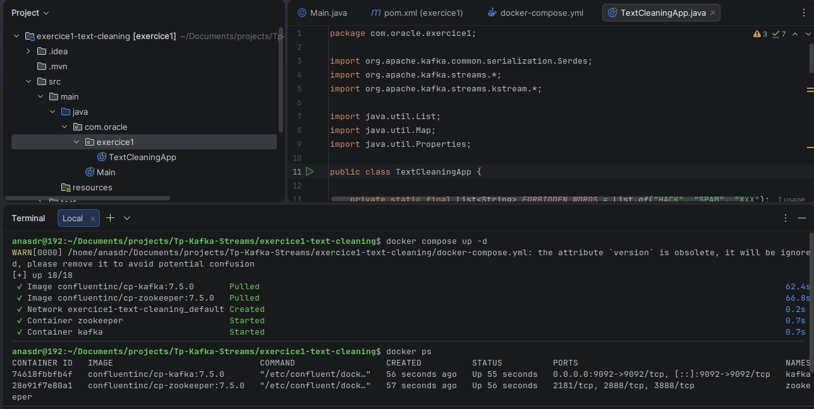
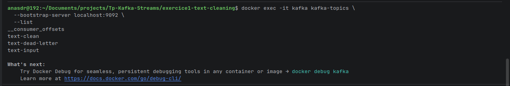
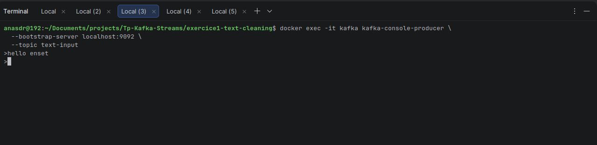
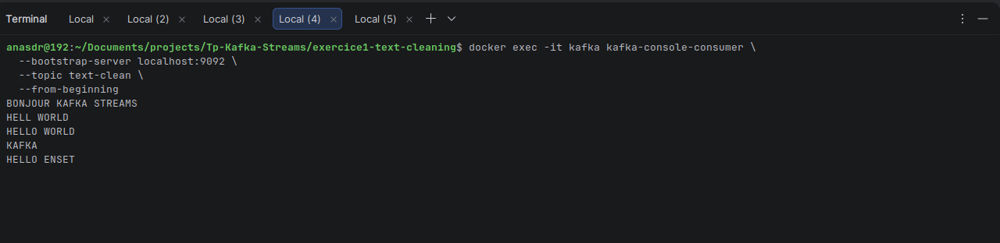
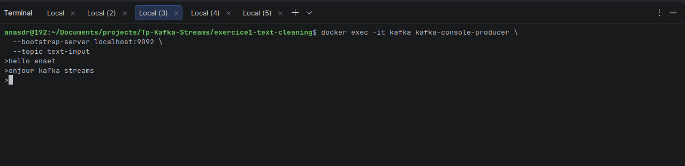
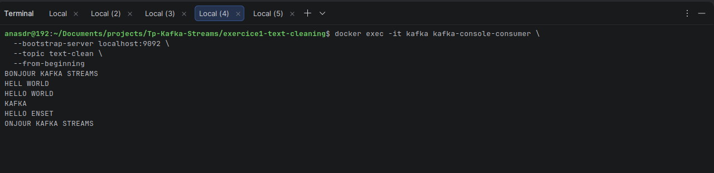
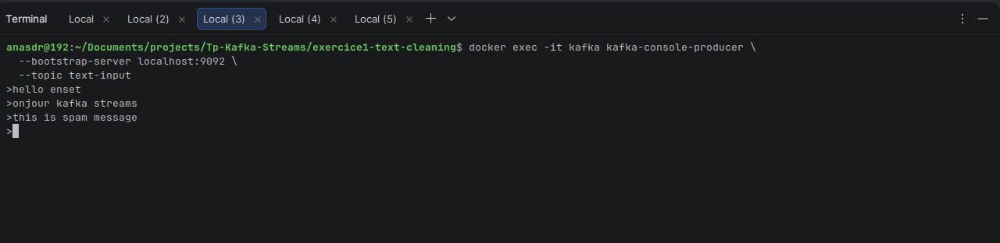
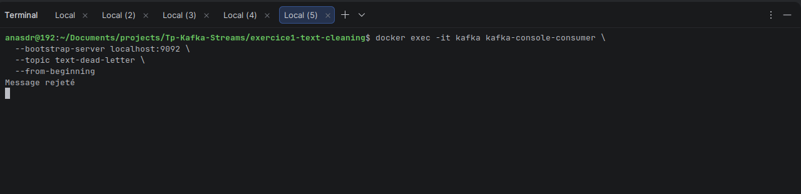
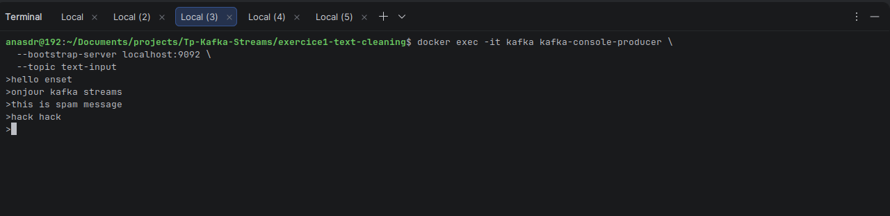
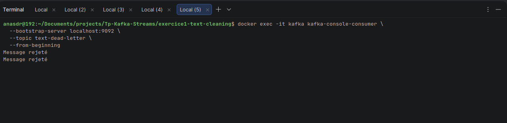

###***Architecture réalisée***

L'application repose sur Kafka Streams et utilise un flux de traitement continu. Les messages sont lus depuis le topic text-input, nettoyés puis validés. Les messages conformes sont envoyés vers le topic text-clean, tandis que les messages invalides sont redirigés vers le topic text-dead-letter.

Schéma d'architecture
text-input
     |
     v
 Nettoyage
     |
     v
 Validation
   /     \
  v       v
text-clean  text-dead-letter

###***Difficultés rencontrées et solutions proposées***
Difficulté 1 : Création des topics Kafka

Problème :

Au démarrage de l'application, une erreur MissingSourceTopicException est apparue car le topic text-input n'existait pas.

Solution :

Création manuelle du topic :
```
docker exec -it kafka kafka-topics \
  --bootstrap-server localhost:9092 \
  --create \
  --topic text-input
```
Difficulté 2 : Configuration du logging

Problème :

L'application affichait un avertissement lié à SLF4J indiquant l'absence d'une implémentation de logging.

Solution :

Ajout de la dépendance :
```
<dependency>
    <groupId>org.slf4j</groupId>
    <artifactId>slf4j-simple</artifactId>
    <version>1.7.36</version>
</dependency>
```
Difficulté 3 : Validation des messages

Problème :

Certains messages contenaient des espaces inutiles ou des mots interdits écrits sous différentes formes.

Solution :

Nettoyage des espaces et conversion systématique en majuscules avant la validation.


# Exercice 2 — Analyse de données météorologiques avec Kafka Streams
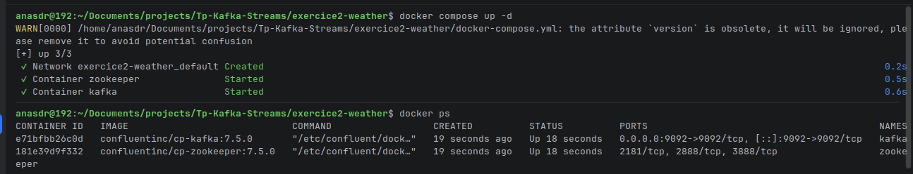
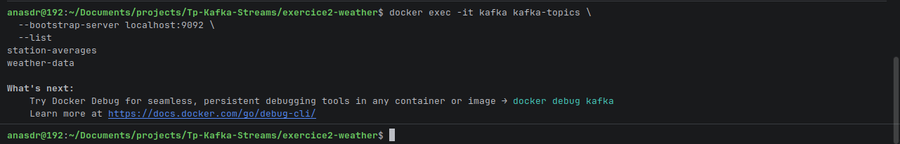
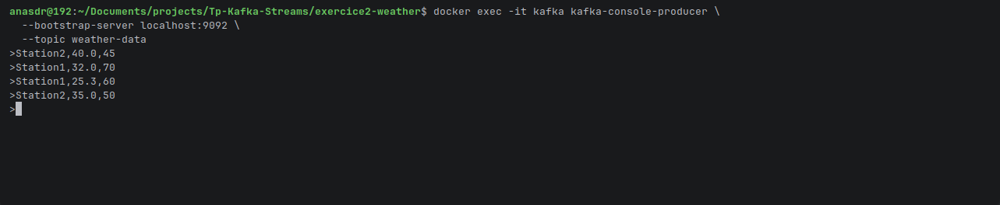
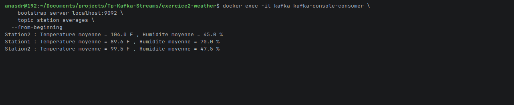


## Architecture réalisée

L'application lit les mesures depuis le topic `weather-data`, extrait les informations utiles, filtre les températures supérieures à 30°C, convertit les températures en Fahrenheit puis réalise des agrégations par station avant de publier les résultats dans `station-averages`.

### Schéma d'architecture

```
weather-data
      |
      v
 Parsing CSV
      |
      v
 Filtrage (>30°C)
      |
      v
 Conversion °F
      |
      v
 Groupement par station
      |
      v
 Calcul des moyennes
      |
      v
 station-averages
```

## Difficultés rencontrées et solutions proposées

### Difficulté 1 : Gestion des messages mal formés

**Problème :**
Certaines lignes pouvaient contenir des valeurs non numériques.

Exemple :
```
Station1,error,60
```

**Solution :**
Utilisation d'un bloc `try-catch` afin d'ignorer les lignes incorrectes sans interrompre l'exécution de l'application.

### Difficulté 2 : Sérialisation des objets Java

**Problème :**
L'utilisation d'objets personnalisés (`WeatherReading` et `StationStats`) nécessitait des mécanismes de sérialisation adaptés.

**Solution :**
Mise en place de Serdes personnalisés ou simplification du traitement à l'aide de chaînes de caractères.

### Difficulté 3 : Vérification du pipeline Kafka Streams

**Problème :**
Lors des tests, certains résultats n'étaient pas publiés dans le topic de sortie.

**Solution :**
Ajout de traces de débogage :

```java
.peek(...)
System.out.println(...)
```

afin de suivre chaque étape du traitement et vérifier le bon fonctionnement du pipeline.

### Difficulté 4 : Compréhension des agrégations

**Problème :**
La mise en œuvre des concepts `KGroupedStream` et `KTable` a nécessité une compréhension approfondie du fonctionnement des agrégations dans Kafka Streams.

**Solution :**
Décomposition du traitement en plusieurs étapes :

1. Lecture du flux.
2. Parsing des données.
3. Filtrage des températures.
4. Conversion Fahrenheit.
5. Regroupement par station.
6. Agrégation.
7. Publication des résultats.

Cette approche a facilité la validation progressive des résultats.

# Exercice 3 — omptage de clics avec Kafka Streams et Spring Boot
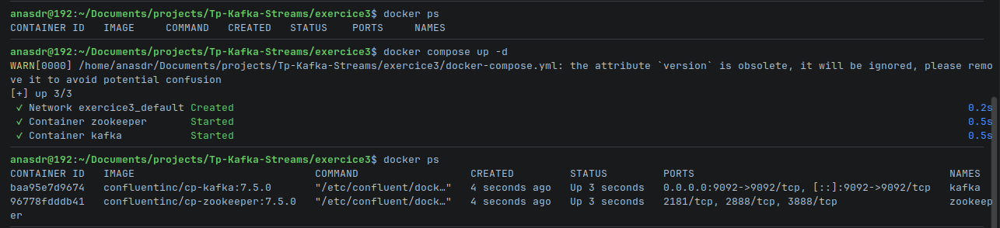
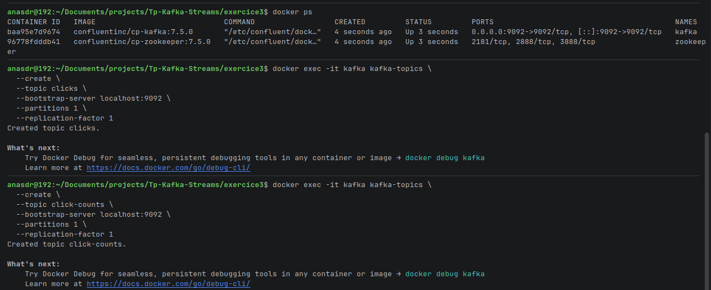
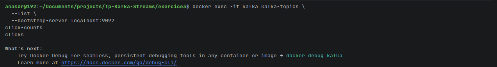
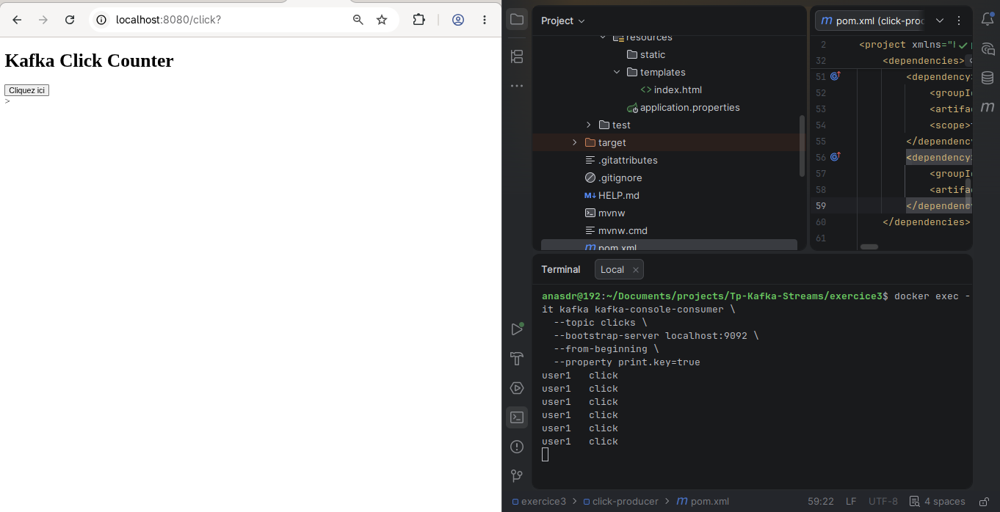
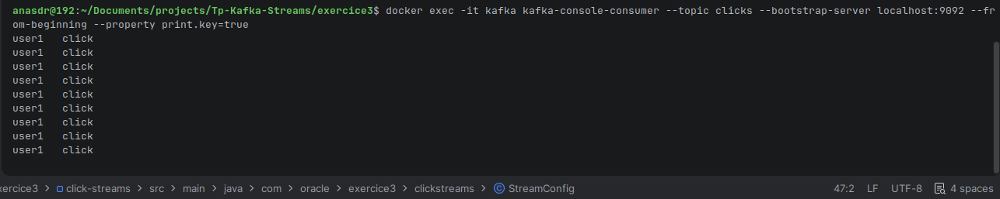
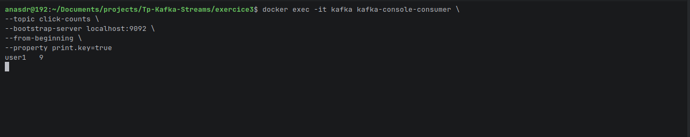
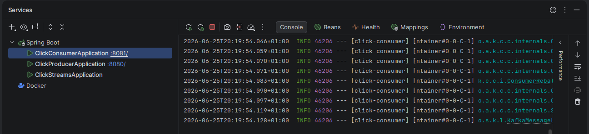
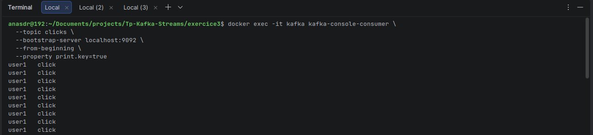
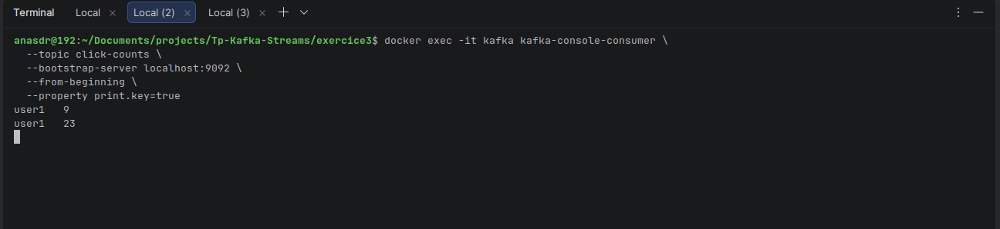
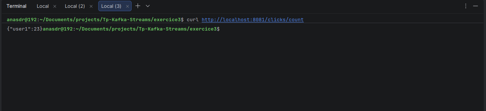

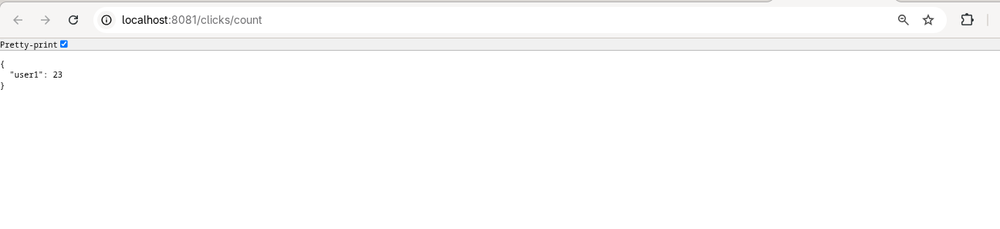
# Exercice 3 — Comptage de clics avec Kafka Streams

## Description du projet

Cet exercice a pour objectif de mettre en œuvre un système de comptage de clics en temps réel à l'aide d'Apache Kafka, Kafka Streams et Spring Boot.

L'application permet à un utilisateur de générer des événements de clic via une interface web. Chaque clic est envoyé dans un topic Kafka nommé `clicks`. Une application Kafka Streams consomme ensuite ces événements, les regroupe par utilisateur et calcule le nombre total de clics effectués. Les résultats sont publiés dans un second topic nommé `click-counts`.

## Architecture réalisée

L'architecture développée repose sur trois composants principaux :

- Une application Spring Boot jouant le rôle de producteur Kafka.
- Un cluster Kafka exécuté dans des conteneurs Docker.
- Une application Kafka Streams chargée du traitement et de l'agrégation des événements.

### Schéma de l'architecture

```
Navigateur Web
      |
      v
Application Spring Boot
(Click Producer)
      |
      v
Topic Kafka : clicks
      |
      v
Kafka Streams
(groupByKey + count)
      |
      v
Topic Kafka : click-counts
      |
      v
Kafka Consumer
(affichage des résultats)
```

### Fonctionnement

1. L'utilisateur clique sur un bouton dans l'interface web.
2. L'application Spring Boot produit un message Kafka dans le topic `clicks`.
3. Kafka Streams consomme les événements.
4. Les clics sont regroupés par utilisateur (`groupByKey()`).
5. Le nombre total de clics est calculé (`count()`).
6. Les résultats sont publiés dans le topic `click-counts`.

## Technologies utilisées

- Java 21
- Spring Boot
- Apache Kafka
- Kafka Streams
- Docker
- Maven

## Création des topics Kafka

### Création du topic `clicks`

```bash
docker exec -it kafka kafka-topics \
  --create \
  --topic clicks \
  --bootstrap-server localhost:9092 \
  --partitions 1 \
  --replication-factor 1
```

### Création du topic `click-counts`

```bash
docker exec -it kafka kafka-topics \
  --create \
  --topic click-counts \
  --bootstrap-server localhost:9092 \
  --partitions 1 \
  --replication-factor 1
```

### Vérification des topics

```bash
docker exec -it kafka kafka-topics \
  --list \
  --bootstrap-server localhost:9092
```

## Consultation des messages

### Consommer les événements de clic

```bash
docker exec -it kafka kafka-console-consumer \
  --topic clicks \
  --bootstrap-server localhost:9092 \
  --from-beginning \
  --property print.key=true
```

### Consommer les résultats agrégés

```bash
docker exec -it kafka kafka-console-consumer \
  --topic click-counts \
  --bootstrap-server localhost:9092 \
  --from-beginning \
  --property print.key=true
```

## Difficultés rencontrées et solutions proposées

### 1. Création des topics Kafka

**Problème :**
Les topics nécessaires n'étaient pas présents lors du démarrage de l'application.

**Solution :**
Création manuelle des topics à l'aide des commandes Kafka exécutées dans le conteneur Docker.

### 2. Adaptation des commandes Kafka à Docker

**Problème :**
Les commandes fournies dans le sujet utilisaient les scripts classiques :

```
kafka-topics.sh
kafka-console-producer.sh
kafka-console-consumer.sh
```

Ces scripts n'étaient pas directement accessibles depuis le système hôte.

**Solution :**
Exécuter les commandes directement dans le conteneur Kafka :

```bash
docker exec -it kafka kafka-topics
docker exec -it kafka kafka-console-producer
docker exec -it kafka kafka-console-consumer
```

### 3. Vérification du pipeline Kafka Streams

**Problème :**
Aucun résultat n'apparaissait dans le topic `click-counts`.

**Solution :**
Utilisation de consommateurs Kafka sur les topics d'entrée et de sortie afin de vérifier chaque étape du traitement.

Cette approche a permis de confirmer que les messages étaient correctement produits puis agrégés.

### 4. Configuration de l'interface web Spring Boot

**Problème :**
L'accès à la page principale retournait une erreur HTTP 404.

**Solution :**
Vérification du contrôleur Spring MVC, de l'emplacement du fichier `index.html` et de la configuration Thymeleaf.

### 5. Compréhension des agrégations Kafka Streams

**Problème :**
La compréhension du mécanisme `groupByKey()` suivi de `count()` a nécessité plusieurs expérimentations.

**Solution :**
Réalisation de tests avec différents utilisateurs afin d'observer l'évolution des compteurs et de valider le fonctionnement des agrégations en temps réel.
